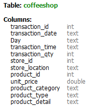
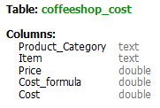

# **SQL and Power BI Project**

## **Project #2 - Cafe Sales Analysis**

### **About the project: ** 
Transaction records for Maven Roasters, a fictitious coffee shop selling hot beverage and baked goods. Dataset includes the transaction date and timestamp along with product-level details, including unit price. Additional table was created with unit cost, in order to do profit calculations.

<ins>Key Requirements:</ins> 
•  Display a summary of Maven Roasters sales trend per month 
•  Identify the days pf the week with the highest sales and customer number 
•  Identify best and least selling products, find the product with the most revenue 

<ins>Sales Trends:</ins> 
• Show total profit per months 
• Show changes in profit each month 

### **About the data:**

The dataset includes six months of sales data between January 2023 and June 2023, with almost 15,000 rows. Each row represents a transaction or purchasing an item from the cafe, including the quantity of purchased products, the price per unit, date and time of the transaction. To enable profit analysis, an additional table was created containing the selling price and cost of each item.

   
  

### ⛔ Dataset limitations & Challenges:

• The dataset only spans January to June 2023, limiting the ability to perform a full-year or comprehensive seasonal analysis. 
• Each product purchased is recorded as a separate transaction, making it challenging to accurately assess the total number of customers and their corresponding spending per visit. 

### **Summary**

<ins>Overview of Findings:</ins>
