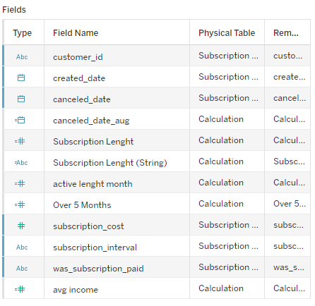

# **SQL and Tableau Projects**

## **Project #1 - Streaming Video Subscriptions Analysis**

### **About the project:** 

Subscription records for MavenFlix, a fictitious video streaming platform. The company needed data on subscription trends, how long a customer uses the platform, and what are the best and worst months. 

<ins>Key Requirements:</ins> 
• Display a summary of total number of new and churned users for each month 
• Identify the months with the highest and lowest number of new/churned users 
• Display the percentage of users that stays less than 5 months 
• Present the duration of subsriptions 

<ins>Sales Trends:</ins> 
• Show total profit per months 
• Show changes in profit each months 

A **Tableau dashboard** can be found here. 
Data Cleaning with SQL can be found [here](mavenflix_data_cleaning_sql).

### **About the data:** 

Dataset includes information about ~2,800 subscribers from September 2022 through September 2023. Each record represents an individual customer's subscription, including the subscription cost, created/canceled date, interval, and payment status. New column month_duration was created to identify the lenght of the subsription. 

### ⛔ Dataset limitations:

• The dataset spans from September 2022 to August 2023, limiting the ability to conduct a comprehensive seasonal analysis.

### **Summary**

<ins>Overview of Findings:</ins>

The data shows that MavenFlix had a higher-than-average number of new users during only a few months: early 2023 and summer 2023. In most months, the number of new subscribers stayed close to the average. However, there isn’t enough data to confirm if the increases in new users during those periods are due to seasonal trends.

On the other hand, cancellations have been steadily rising since September 2022. Starting in February 2023, cancellations have consistently been above the average, with the highest number occurring in June 2023. This sharp increase might be due to competition, such as another service offering better features or pricing. Conducting a user survey could help identify the reasons behind this trend.

Retention is also a concern, as more than half of the users cancel their subscription before reaching five months. Only 45% of users have stayed with MavenFlix for more than five months, including active users. The highest number of cancellations happens after just two months. This is another area that could benefit from further investigation, potentially through a user feedback survey.

### **Recommendation**

Based on the uncovered insights, the following recommendations have been provided:

• **Conducting a user survey** would help identify the reason behind the high cancellation rate. 
• **Analyze competitors** to see where MavenFlix can improve its service and offer more value to its users. 
• **Consider introducing different subscription plans** for new users. Right now, there is only one option, and having more variety could help attract and retain users by giving them more choices. 

